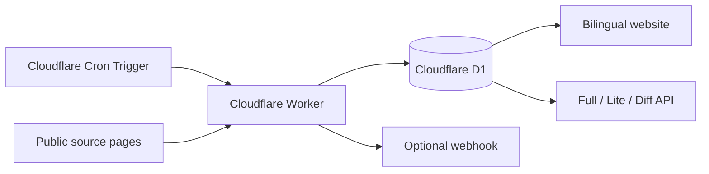

# WarpKey Edge Console

[English](README.md) | [简体中文](README_CN.md)

[](https://deploy.workers.cloudflare.com/?url=https://github.com/nas-tool/warpkey)
[](LICENSE)
[](https://workers.cloudflare.com/)

WarpKey is a small, public Cloudflare Warp+ key list service. It collects candidate keys from configured public sources, stores the current state and change history in Cloudflare D1, and exposes Full and Lite lists through a bilingual website and plain-text APIs.

No VPS, long-running process, external database, account system, or login page is required.

## Live Demo

- Website: <https://warpkey-edge-console.niubiplus.workers.dev/>
- English: <https://warpkey-edge-console.niubiplus.workers.dev/en>
- 中文: <https://warpkey-edge-console.niubiplus.workers.dev/zh>
- Full list: <https://warpkey-edge-console.niubiplus.workers.dev/api/full>
- Lite list: <https://warpkey-edge-console.niubiplus.workers.dev/api/lite>

## Features

- Runs entirely on Cloudflare Workers and D1.
- Collects from multiple public source pages on an hourly Cron Trigger.
- Extracts, normalizes, and deduplicates Warp+ key candidates.
- Keeps up to 100 keys in the public Full response.
- Generates a 15-key Lite selection after every successful collection.
- Tracks added and removed keys between collection runs.
- Avoids mass deletion when one or more sources fail.
- Sends signed webhook notifications for changes and collection failures.
- Provides Chinese and English pages without changing the data API URLs.
- Supports Cloudflare's Deploy Button and a one-command Wrangler deployment.

## Architecture



Collection flow:

1. The Cron Trigger starts a collection run.
2. The Worker fetches all enabled sources concurrently.
3. Candidate keys are extracted from HTML `<code>` elements.
4. Keys are normalized and deduplicated.
5. D1 is updated with the current state and change events.
6. A new Lite selection is generated.
7. If enabled, a signed webhook is sent.

## One-click Deployment

Click the button below and follow the Cloudflare setup flow:

[](https://deploy.workers.cloudflare.com/?url=https://github.com/nas-tool/warpkey)

Cloudflare will clone the repository, provision the required D1 database, apply the migrations, and deploy the Worker.

After deployment, the key list may remain empty until the first Cron run. The default schedule is minute `7` of every hour.

## Manual Deployment

Requirements:

- Node.js 20 or later
- pnpm
- A Cloudflare account

```bash
git clone https://github.com/nas-tool/warpkey.git
cd warpkey
pnpm install
pnpm exec wrangler login
pnpm deploy
```

The deployment script will:

1. Create a D1 database when the configuration still contains the placeholder ID.
2. Update `wrangler.jsonc` with the new database ID.
3. Apply all remote D1 migrations.
4. Deploy the Worker and Cron Trigger.

To hint the D1 primary location during manual creation:

```bash
D1_LOCATION=apac pnpm deploy
```

Supported location values include `weur`, `eeur`, `apac`, `oc`, `wnam`, and `enam`.

To deploy an existing Worker database without creating a new one:

```bash
D1_DATABASE_ID=<existing-d1-uuid> pnpm deploy
```

## Configuration

Application settings live in [`wrangler.jsonc`](wrangler.jsonc).

| Variable | Default | Description |
| --- | --- | --- |
| `APP_NAME` | `WarpKey Edge Console` | Service name returned by the health endpoint. |
| `COLLECTION_CRON` | `7 * * * *` | Informational copy of the Cron schedule. The actual trigger is configured under `triggers.crons`. |
| `PUBLIC_BASE_URL` | Unset | Optional public deployment URL included in webhook payload links. |
| `WEBHOOK_ENABLED` | `false` | Set to `true` to enable webhook delivery. |
| `WEBHOOK_URL` | Unset | HTTPS endpoint receiving webhook POST requests. |
| `WEBHOOK_SECRET` | Unset | Optional HMAC-SHA256 signing secret. |
| `WEBHOOK_EVENTS` | `keys.changed,collection.failed` | Comma-separated events to deliver. |

The default Cron configuration is:

```jsonc
"triggers": {
  "crons": ["7 * * * *"]
}
```

## Webhook

Configure the webhook in `wrangler.jsonc`:

```jsonc
"vars": {
  "PUBLIC_BASE_URL": "https://your-worker.example.workers.dev",
  "WEBHOOK_ENABLED": "true",
  "WEBHOOK_URL": "https://example.com/hooks/warpkey",
  "WEBHOOK_SECRET": "replace-with-a-random-secret",
  "WEBHOOK_EVENTS": "keys.changed,collection.failed"
}
```

For a private signing secret, remove `WEBHOOK_SECRET` from `vars` and use a Worker secret instead:

```bash
pnpm exec wrangler secret put WEBHOOK_SECRET
pnpm exec wrangler deploy
```

Webhook headers:

```http
Content-Type: application/json
X-WarpKey-Event: keys.changed
X-WarpKey-Signature: sha256=<hex-hmac-sha256>
```

Example payload:

```json
{
  "event": "keys.changed",
  "sent_at": "2026-07-18T01:20:00.000Z",
  "run": {
    "id": "run_example",
    "status": "success",
    "started_at": 1784337600,
    "finished_at": 1784337601,
    "sources": "4/4"
  },
  "changes": {
    "added": ["abcdefgh-12345678-ijklmnop"],
    "removed": []
  },
  "links": {
    "full": "https://example.workers.dev/api/full",
    "lite": "https://example.workers.dev/api/lite",
    "diff": "https://example.workers.dev/api/diff"
  }
}
```

The signature is calculated from the raw request body:

```text
hex(HMAC-SHA256(WEBHOOK_SECRET, raw_request_body))
```

Failed deliveries are attempted up to three times and recorded in the `webhook_deliveries` D1 table.

## API

| Endpoint | Format | Description |
| --- | --- | --- |
| `GET /api/full` | Plain text | Up to 100 active keys, one per line. |
| `GET /api/lite` | Plain text | Up to 15 selected keys, one per line. |
| `GET /api/diff` | JSON | Latest run and its added/removed keys. |
| `GET /api/status` | JSON | Active count, source count, update time, and latest run. |
| `GET /health` | JSON | Basic Worker health response. |

Examples:

```bash
curl -sL https://your-worker.example.workers.dev/api/full
curl -sL https://your-worker.example.workers.dev/api/lite > warp-keys.txt
curl -sL https://your-worker.example.workers.dev/api/diff | jq
```

Public API responses include permissive CORS headers and edge-cache directives.

## Languages

| Path | Page |
| --- | --- |
| `/` | Redirects according to the `Accept-Language` header. |
| `/en` | English home page. |
| `/zh` | Chinese home page. |
| `/en/api` | English API documentation. |
| `/zh/api` | Chinese API documentation. |

The data API paths are language-independent.

## Source Configuration

The default public sources are inserted by [`migrations/0001_initial.sql`](migrations/0001_initial.sql).

To change the defaults for a new deployment, edit the source rows in that migration before deploying. For an existing deployment, update the `sources` table with Wrangler:

```bash
pnpm exec wrangler d1 execute DB --remote --command \
  "INSERT INTO sources (id, name, url, enabled, created_at, updated_at) VALUES ('example', 'Example', 'https://example.com/keys', 1, unixepoch(), unixepoch());"
```

Only HTTPS public pages containing candidate keys inside `<code>` elements are supported by the built-in collector.

## Local Development

```bash
pnpm install
pnpm db:migrate:local
pnpm dev
```

Open <http://localhost:8787>.

Trigger the scheduled handler locally:

```bash
curl http://localhost:8787/cdn-cgi/handler/scheduled
```

Run validation:

```bash
pnpm check
pnpm exec wrangler deploy --dry-run
```

## Data Model

The D1 migration creates the following core tables:

- `sources`: collection source configuration.
- `keys`: current key status and timestamps.
- `key_sources`: source-to-key relationship.
- `collection_runs`: collection status and statistics.
- `key_events`: added and removed events.
- `lite_keys`: current Lite selection.
- `webhook_deliveries`: webhook delivery results.
- `collection_lock`: prevents overlapping collection runs.

## Project Structure

```text
src/index.tsx       Worker routes, public APIs, locale routing, and Cron handler
src/collector.ts    Source fetching, parsing, deduplication, and diff generation
src/webhooks.ts     Webhook payloads, HMAC signatures, retries, and logging
src/ui.tsx          Chinese and English server-rendered pages
src/types.ts        Worker environment and shared types
migrations/         D1 schema and default sources
scripts/deploy.mjs  D1 provisioning, migration, and Worker deployment
wrangler.jsonc      Cloudflare bindings, variables, and Cron configuration
```

## Safety and Limitations

- A source returning no matching keys is treated as failed.
- Missing keys are marked inactive only when every enabled source succeeds.
- The built-in validation is structural: it verifies the expected `8-8-8` candidate format. It does not register accounts or perform invasive account operations.
- Cloudflare Workers cannot run a full browser such as Playwright in this deployment.
- Public source pages may change format, rate-limit requests, or become unavailable.

## Troubleshooting

### The website is empty after deployment

Wait for the next Cron run. The default trigger runs at minute `7` of every hour. Check `/api/status` and the `collection_runs` D1 table for details.

### A source fails

Inspect the latest `collection_runs.error` value:

```bash
pnpm exec wrangler d1 execute DB --remote --command \
  "SELECT status, error, started_at FROM collection_runs ORDER BY started_at DESC LIMIT 5;"
```

### The Deploy Button cannot use an existing database ID

Keep the placeholder database ID from the repository. Cloudflare's deployment flow or `scripts/deploy.mjs` will provision a database for the target account.

## Disclaimer

This project is not affiliated with or endorsed by Cloudflare. Data is collected from third-party public sources. Users are responsible for complying with applicable terms of service, laws, and policies.

## License

[MIT](LICENSE)
