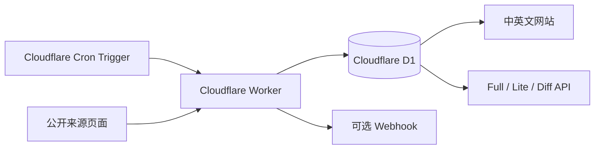

# WarpKey Edge Console

[English](README.md) | [简体中文](README_CN.md)

[](https://deploy.workers.cloudflare.com/?url=https://github.com/nas-tool/warpkey)
[](LICENSE)
[](https://workers.cloudflare.com/)

WarpKey 是一个完全运行在 Cloudflare 上的公开 Warp+ 密钥列表服务。它定时从配置的公开来源采集候选密钥，将当前状态和变化历史保存到 Cloudflare D1，并通过中英文网页和纯文本 API 提供 Full 与 Lite 两种列表。

不需要 VPS、常驻进程、外部数据库、账号系统或登录页面。

## 在线演示

- 网站：<https://warpkey-edge-console.niubiplus.workers.dev/>
- 中文：<https://warpkey-edge-console.niubiplus.workers.dev/zh>
- English：<https://warpkey-edge-console.niubiplus.workers.dev/en>
- Full 列表：<https://warpkey-edge-console.niubiplus.workers.dev/api/full>
- Lite 列表：<https://warpkey-edge-console.niubiplus.workers.dev/api/lite>

## 功能

- 完全运行在 Cloudflare Workers 和 D1。
- 通过 Cron Trigger 每小时从多个公开来源采集。
- 提取、格式化并去重 Warp+ 候选密钥。
- Full API 最多公开 100 个密钥。
- 每次成功采集后重新生成 15 个 Lite 密钥。
- 记录每次采集的新增和移除变化。
- 部分来源失败时不会批量删除现有数据。
- 支持密钥变化和采集失败 Webhook 推送。
- 支持中英文页面，数据 API 地址保持不变。
- 支持 Cloudflare Deploy Button 和一条命令部署。

## 架构



采集流程：

1. Cron Trigger 启动采集任务。
2. Worker 并发请求所有启用的来源。
3. 从 HTML `<code>` 元素中提取候选密钥。
4. 格式化并去重。
5. 更新 D1 当前状态和变化事件。
6. 生成新的 Lite 列表。
7. 启用 Webhook 时发送签名通知。

## 一键部署

点击按钮并按照 Cloudflare 页面完成部署：

[](https://deploy.workers.cloudflare.com/?url=https://github.com/nas-tool/warpkey)

Cloudflare 会克隆仓库、创建并绑定 D1、执行迁移并部署 Worker。

部署完成后，首次 Cron 运行前列表可能为空。默认计划是每小时第 `7` 分钟运行。

## 手动部署

要求：

- Node.js 20 或更高版本
- pnpm
- Cloudflare 账号

```bash
git clone https://github.com/nas-tool/warpkey.git
cd warpkey
pnpm install
pnpm exec wrangler login
pnpm deploy
```

部署脚本会：

1. 检测配置中的占位数据库 ID。
2. 自动创建 D1 并更新 `wrangler.jsonc`。
3. 执行远程 D1 迁移。
4. 部署 Worker 和 Cron Trigger。

手动创建 D1 时可以指定位置：

```bash
D1_LOCATION=apac pnpm deploy
```

支持 `weur`、`eeur`、`apac`、`oc`、`wnam` 和 `enam`。

如果需要继续部署到已有的 D1，而不是创建新的数据库：

```bash
D1_DATABASE_ID=<existing-d1-uuid> pnpm deploy
```

## 配置

应用配置位于 [`wrangler.jsonc`](wrangler.jsonc)。

| 变量 | 默认值 | 说明 |
| --- | --- | --- |
| `APP_NAME` | `WarpKey Edge Console` | 健康检查返回的服务名称。 |
| `COLLECTION_CRON` | `7 * * * *` | Cron 计划的说明值；实际触发计划在 `triggers.crons`。 |
| `PUBLIC_BASE_URL` | 未配置 | 可选的 Webhook payload 公开部署地址。 |
| `WEBHOOK_ENABLED` | `false` | 设置为 `true` 后启用推送。 |
| `WEBHOOK_URL` | 未配置 | 接收 POST 请求的 HTTPS 地址。 |
| `WEBHOOK_SECRET` | 未配置 | 可选的 HMAC-SHA256 签名密钥。 |
| `WEBHOOK_EVENTS` | `keys.changed,collection.failed` | 需要推送的事件，使用逗号分隔。 |

默认 Cron：

```jsonc
"triggers": {
  "crons": ["7 * * * *"]
}
```

## Webhook 推送

在 `wrangler.jsonc` 中配置：

```jsonc
"vars": {
  "PUBLIC_BASE_URL": "https://your-worker.example.workers.dev",
  "WEBHOOK_ENABLED": "true",
  "WEBHOOK_URL": "https://example.com/hooks/warpkey",
  "WEBHOOK_SECRET": "replace-with-a-random-secret",
  "WEBHOOK_EVENTS": "keys.changed,collection.failed"
}
```

如果不希望把签名密钥提交到 Git，可从 `vars` 删除 `WEBHOOK_SECRET`，改用 Worker Secret：

```bash
pnpm exec wrangler secret put WEBHOOK_SECRET
pnpm exec wrangler deploy
```

请求头：

```http
Content-Type: application/json
X-WarpKey-Event: keys.changed
X-WarpKey-Signature: sha256=<hex-hmac-sha256>
```

Payload 示例：

```json
{
  "event": "keys.changed",
  "sent_at": "2026-07-18T01:20:00.000Z",
  "run": {
    "id": "run_example",
    "status": "success",
    "started_at": 1784337600,
    "finished_at": 1784337601,
    "sources": "4/4"
  },
  "changes": {
    "added": ["abcdefgh-12345678-ijklmnop"],
    "removed": []
  },
  "links": {
    "full": "https://example.workers.dev/api/full",
    "lite": "https://example.workers.dev/api/lite",
    "diff": "https://example.workers.dev/api/diff"
  }
}
```

签名计算：

```text
hex(HMAC-SHA256(WEBHOOK_SECRET, raw_request_body))
```

失败推送最多尝试三次，结果记录在 D1 的 `webhook_deliveries` 表。

## API

| 接口 | 格式 | 说明 |
| --- | --- | --- |
| `GET /api/full` | 纯文本 | 最多 100 个有效密钥，每行一个。 |
| `GET /api/lite` | 纯文本 | 最多 15 个精选密钥，每行一个。 |
| `GET /api/diff` | JSON | 最近一次采集以及新增、移除密钥。 |
| `GET /api/status` | JSON | 有效数量、来源数量、更新时间和最近采集。 |
| `GET /health` | JSON | Worker 基础健康状态。 |

示例：

```bash
curl -sL https://your-worker.example.workers.dev/api/full
curl -sL https://your-worker.example.workers.dev/api/lite > warp-keys.txt
curl -sL https://your-worker.example.workers.dev/api/diff | jq
```

公开 API 包含宽松 CORS 响应头和边缘缓存指令。

## 中英文页面

| 路径 | 页面 |
| --- | --- |
| `/` | 根据 `Accept-Language` 自动跳转。 |
| `/zh` | 中文首页。 |
| `/en` | English 首页。 |
| `/zh/api` | 中文 API 文档。 |
| `/en/api` | English API 文档。 |

数据 API 不区分语言。

## 来源配置

默认公开来源由 [`migrations/0001_initial.sql`](migrations/0001_initial.sql) 写入。

新部署可以直接编辑迁移中的来源。已有部署可以通过 Wrangler 更新 `sources` 表：

```bash
pnpm exec wrangler d1 execute DB --remote --command \
  "INSERT INTO sources (id, name, url, enabled, created_at, updated_at) VALUES ('example', 'Example', 'https://example.com/keys', 1, unixepoch(), unixepoch());"
```

内置采集器支持包含 `<code>` 元素的 HTTPS 公开页面。

## 本地开发

```bash
pnpm install
pnpm db:migrate:local
pnpm dev
```

打开 <http://localhost:8787>。

本地触发 Cron：

```bash
curl http://localhost:8787/cdn-cgi/handler/scheduled
```

运行检查：

```bash
pnpm check
pnpm exec wrangler deploy --dry-run
```

## 数据表

- `sources`：采集来源配置。
- `keys`：当前密钥状态和时间。
- `key_sources`：密钥与来源关系。
- `collection_runs`：采集状态和统计。
- `key_events`：新增、移除事件。
- `lite_keys`：当前 Lite 列表。
- `webhook_deliveries`：Webhook 推送记录。
- `collection_lock`：避免采集任务重叠。

## 项目结构

```text
src/index.tsx       Worker 路由、公开 API、多语言路由和 Cron
src/collector.ts    来源请求、解析、去重和变化计算
src/webhooks.ts     Webhook payload、签名、重试和记录
src/ui.tsx          中英文服务端渲染页面
src/types.ts        Worker 环境和共享类型
migrations/         D1 数据结构和默认来源
scripts/deploy.mjs  D1 创建、迁移和 Worker 部署
wrangler.jsonc      Cloudflare 绑定、环境变量和 Cron
```

## 安全与限制

- 来源页面没有匹配密钥时会被视为失败。
- 只有所有启用来源都成功时，缺失密钥才会被标记为无效。
- 内置验证是结构验证，只检查预期的 `8-8-8` 格式；不会注册账号或执行侵入式操作。
- 此 Worker 部署不能运行 Playwright 等完整浏览器。
- 公开来源可能变更页面格式、限制请求或停止服务。

## 故障排查

### 部署后列表为空

等待下一次 Cron。默认在每小时第 `7` 分钟运行。可以检查 `/api/status` 和 D1 的 `collection_runs` 表。

### 来源失败

```bash
pnpm exec wrangler d1 execute DB --remote --command \
  "SELECT status, error, started_at FROM collection_runs ORDER BY started_at DESC LIMIT 5;"
```

### Deploy Button 无法使用已有数据库 ID

开源仓库中应保留占位数据库 ID。Cloudflare 部署流程或 `scripts/deploy.mjs` 会为目标账号创建数据库。

## 免责声明

本项目与 Cloudflare 无隶属或认可关系。数据来自第三方公开来源，使用者有责任遵守适用的服务条款、法律和政策。

## License

[MIT](LICENSE)
